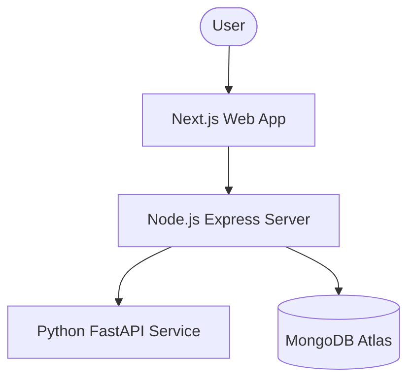

# Integration & Deployment Guide - AI Health Risk Predictor

This guide explains how to set up, integrate, and deploy the entire AI Health Risk Predictor ecosystem.

## Architecture Overview



---

## 1. Prerequisites

- **Node.js**: v18+ 
- **Python**: v3.9+
- **MongoDB**: Atlas account or local instance

---

## 2. Environment Setup

### AI Service (`ai-service/.env`)
```
PORT=8000
```
*Note: Run `python main.py` to start.*

### Backend Server (`backend/.env`)
```
PORT=5000
MONGO_URI=your_mongodb_atlas_uri
JWT_SECRET=your_jwt_secret_key
AI_SERVICE_URL=http://localhost:8000
```

### Web Frontend (`frontend-web/.env.local`)
```
NEXT_PUBLIC_API_URL=http://localhost:5000/api
```

---

## 3. Installation & Local Development

### Step 1: AI Service
```bash
cd ai-service
pip install -r requirements.txt
python main.py
```
*Access at: http://localhost:8000*

### Step 2: Backend
```bash
cd backend
npm install
npm start
```
*Access at: http://localhost:5000*

### Step 3: Web Frontend
```bash
cd frontend-web
npm install
npm run dev
```
*Access at: http://localhost:3000*

---

## 4. Deployment Strategy

### AI Service (Python)
- **Platforms**: Render, Railway, or AWS Lambda.
- **Process**: Containerize with Docker for best results on cloud providers.

### Backend (Node.js)
- **Platforms**: Render, Heroku, or DigitalOcean.
- **Process**: Ensure `MONGO_URI` and `AI_SERVICE_URL` are set in the environment variables.

### Web (Next.js)
- **Platforms**: Vercel (recommended) or Netlify.
- **Process**: Automatic deployment on git push. Set `NEXT_PUBLIC_API_URL`.

---

## 5. Troubleshooting

> [!IMPORTANT]
> **Cross-Origin Issues**: If the frontend cannot talk to the backend, ensure `CORS` is correctly configured in `backend/server.js`.

---

## 6. Maintenance

- **Model Retraining**: Trigger the `/train` endpoint in the AI service to update the model with new data.
- **Security**: Regularly rotate JWT secrets and database credentials.
